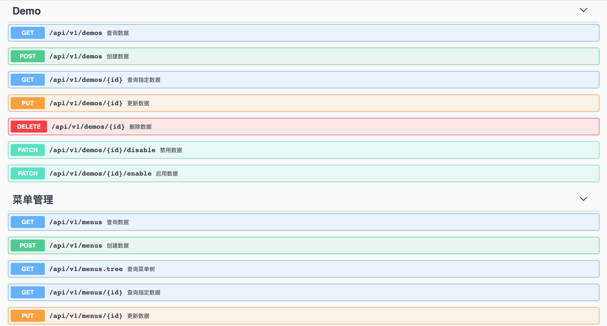

<h1 align="center">Gin Admin</h1>

<div align="center">
 基于 Gin + GORM + Casbin + Dig 实现的RBAC权限管理脚手架，目的是提供一套轻量的中后台开发框架，方便、快速的完成业务需求的开发。
<br/>

[![ReportCard][reportcard-image]][reportcard-url] [![GoDoc][godoc-image]][godoc-url] [![License][license-image]][license-url]

</div>

- [在线演示地址](http://demo.tiannianshou.com) (用户名：root，密码：abc-123)（`温馨提醒：为了达到更好的演示效果，这里给出了拥有最高权限的用户，请手下留情，只操作自己新增的数据，不要动平台本身的数据！谢谢！`）
- [Swagger 文档地址](http://demo.tiannianshou.com/swagger/)



## 特性

- 遵循 RESTful API 设计规范
- 基于 Casbin 的 RBAC 访问控制模型
- 存储分离(存储层对外采用接口的方式供业务层调用，实现了存储层的完全隔离)
- 依赖注入(基于[dig](http://go.uber.org/dig))
- 日志追踪(基于[logrus](https://github.com/sirupsen/logrus)，日志钩子支持 gorm)
- JWT 认证(基于黑名单的认证模式，存储支持：file/redis)
- 支持 Swagger 文档
- 单元测试

## 使用[gin-admin-cli](https://github.com/LyricTian/gin-admin-cli)工具快速开始

### 快速创建并运行项目

```bash
$ go get -u github.com/LyricTian/gin-admin-cli
$ gin-admin-cli new -m -d ~/go/src/gin-admin -p gin-admin
$ cd ~/go/src/gin-admin
$ make start
```

> 启动成功之后，可在浏览器中输入地址访问：[http://127.0.0.1:10088/swagger/](http://127.0.0.1:10088/swagger/)

### 快速生成功能模块(`以Task为例`，具体可参考：[gin-admin-cli](https://github.com/LyricTian/gin-admin-cli))

```bash
gin-admin-cli g -d ~/go/src/gin-admin -p gin-admin -n Task -c '任务管理'
```

## 下载并运行

### 获取代码

```bash
go get -v github.com/LyricTian/gin-admin/cmd/server
```

### 运行

> root 用户的用户名及密码在配置文件(`configs/config.toml`)中，默认为：root/abc-123

#### 运行服务

> 也可以使用脚本运行(详情可查看`Makefile`)：`make start`

```bash
cd github.com/LyricTian/gin-admin/cmd/server
go build -o server
./server -c ../../configs/config.toml -m ../../configs/model.conf -swagger ../../internal/app/swagger
```

> 启动成功之后，可在浏览器中输入地址访问：[http://127.0.0.1:10088/swagger/](http://127.0.0.1:10088/swagger/)

#### 温馨提醒

1. 默认配置采用的是 sqlite 数据库，数据库文件(`自动生成`)在`data/gadmin.db`。如果想切换为`mysql`或`postgres`，请更改配置文件，并创建数据库（数据库创建脚本在`script`目录下）。
2. 日志的默认配置为标准输出，如果想切换到写入文件或写入到 gorm 存储，可以自行切换配置。

## 前端实现

- [gin-admin-react](https://github.com/LyricTian/gin-admin-react)：基于[Ant Design React](https://ant.design)的实现版本

## Swagger 文档的使用

> 文档规则请参考：[https://github.com/teambition/swaggo/wiki/Declarative-Comments-Format](https://github.com/teambition/swaggo/wiki/Declarative-Comments-Format)

### 安装工具并生成文档

```
go get -u -v github.com/teambition/swaggo
swaggo -s ./internal/app/routers/api/swagger.go -p . -o ./internal/app/swagger
```

生成文档之后，可在浏览器中输入地址访问：[http://127.0.0.1:10088/swagger/](http://127.0.0.1:10088/swagger/)

## 项目结构概览

```
.
├── cmd
│   └── server：主服务
├── configs：配置文件目录
├── docs：文档目录
├── internal：内部应用
│   └── app：主应用目录
│       ├── bll：业务逻辑层接口
│       │   └── impl：业务逻辑层的接口实现
│       ├── config：配置参数（与配置文件一一映射）
│       ├── context：统一上下文
│       ├── errors：统一的错误定义
│       ├── ginplus：gin的扩展函数库
│       ├── middleware：gin中间件
│       ├── model：存储层接口
│       │   └── impl：存储层接口实现
│       ├── routers：路由层
│       │   └── api：/api路由模块
│       │       └── ctl：/api路由模块对应的控制器层
│       ├── schema：对象模型
│       ├── swagger：swagger静态目录
│       └── test：单元测试
├── pkg：公共模块
│   ├── auth：认证模块
│   │   └── jwtauth：JWT认证模块实现
│   ├── gormplus：gorm扩展实现
│   ├── logger：日志模块
│   └── util：工具库
└── scripts：执行脚本
```

## 感谢以下框架的开源支持

- [Gin] - [https://gin-gonic.com/](https://gin-gonic.com/)
- [GORM] - [http://gorm.io/](http://gorm.io/)
- [Casbin] - [https://casbin.org/](https://casbin.org/)
- [Dig] - [http://go.uber.org/dig](http://go.uber.org/dig)

## MIT License

    Copyright (c) 2019 Lyric

## 与作者对话

> 该项目是利用业余时间进行开发的，开发思路主要是来源于自己的项目积累及个人思考，如果您有更好的想法和建议请与我进行沟通，我非常期待！下面是我的微信二维码：


[reportcard-url]: https://goreportcard.com/report/github.com/LyricTian/gin-admin
[reportcard-image]: https://goreportcard.com/badge/github.com/LyricTian/gin-admin
[godoc-url]: https://godoc.org/github.com/LyricTian/gin-admin
[godoc-image]: https://godoc.org/github.com/LyricTian/gin-admin?status.svg
[license-url]: http://opensource.org/licenses/MIT
[license-image]: https://img.shields.io/npm/l/express.svg
