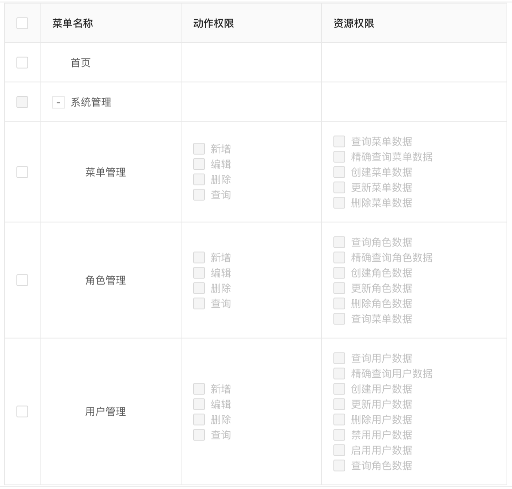

<h1 align="center">Gin Admin</h1>

<div align="center">
 基于 Gin + GORM + Casbin + Ant Design React 实现的RBAC权限管理脚手架，目的是提供一套轻量的中后台开发框架，方便、快速的完成业务需求的开发。

[![ReportCard][reportcard-image]][reportcard-url] [![GoDoc][godoc-image]][godoc-url] [![License][license-image]][license-url]



</div>

- :label: [在线演示地址](https://demo.tiannianshou.com) (用户名：root，密码：abc-123)（`温馨提醒：为了达到更好的演示效果，这里给出了拥有最高权限的用户，请手下留情，只操作自己新增的数据，不要动平台本身的数据！谢谢！`）
- :label: [Swagger 文档地址](https://demo.tiannianshou.com/swagger/)


## 特性

- 遵循 RESTful API 设计规范
- 基于 Casbin 的 RBAC 访问控制模型
- 依赖注入
- 存储分离(存储层对外采用接口的方式供业务层调用，实现了存储层的完全隔离，可以非常方便的更换存储方式)
- 支持统一的事务管理
- 日志追踪(基于[logrus](https://github.com/sirupsen/logrus)，日志钩子支持 gorm)
- JWT 认证(采用黑名单方式，存储支持：file/redis)
- 支持 Swagger 文档
- 支持跨域请求
- 支持请求频次限制
- 支持静态站点
- HTTP 优雅重启
- 单元测试

## 下载并运行

### 获取代码

```
go get -v github.com/LyricTian/gin-admin/...
```

### 运行

> root 用户的用户名及密码在配置文件(config/config.toml)中，默认为：root/abc-123

#### 编译并运行服务

> 也可以使用脚本运行(详情可查看`Makefile`)：make start-dev-server

```
cd $GOPATH/src/github.com/LyricTian/gin-admin
go build -o ./cmd/server/server ./cmd/server
./cmd/server/server -c ./config/config.toml -m ./config/model.conf -swagger ./src/web/swagger
```

#### 温馨提醒

1. 默认配置采用的是 sqlite 数据库，数据库文件在`data/gadmin.db`。如果想切换为`mysql`或`postgres`，需要先创建数据库（数据库创建脚本在`script`目录下）。
2. 日志的默认配置为写入本地文件，日志文件在`data/gadmin.log`。如果想切换到输出控制台或写入到 gorm 存储，可以自行切换配置。

#### 安装依赖包并运行前端

> 也可以使用脚本运行(详情可查看`Makefile`)：make start-dev-web

```
cd $GOPATH/src/github.com/LyricTian/gin-admin
cd web
npm install
npm start
```

## Swagger 文档的使用

> 文档规则请参考：[https://github.com/teambition/swaggo/wiki/Declarative-Comments-Format](https://github.com/teambition/swaggo/wiki/Declarative-Comments-Format)

### 安装工具并生成文档

```
go get -u -v github.com/teambition/swaggo
cd src/web
swaggo -s ./swagger.go -p ../ -o ./swagger
```

生成文档之后，可在浏览器中输入地址访问：[http://127.0.0.1:10088/swagger/](http://127.0.0.1:10088/swagger/)

## 项目结构概览

- cmd #存放用于编译可运行程序的 main 源码
  - server #主服务
- config #配置文件
- doc #文档
- script #脚本
- src #go源码目录
  - auth #认证模块
  - bll #业务逻辑处理模块
  - config #配置文件（主要用于go源码与配置文件之间的映射）
  - context #全局上下文（提供统一的用户ID和事务的上下文数据）
  - errors #统一的错误处理模块
  - inject #依赖注入初始化模块
  - logger #日志模块
  - model #存储层模块（提供统一的存储层接口及实现）
    - gorm #gorm存储层实现
      - entity #数据库实体与表的映射
      - model #存储层实现
  - schema #数据模型对象，与数据库无关
  - service #对外部服务的封装
  - util #工具函数
  - web #HTTP服务源码
    - context #提供HTTP处理上下文
    - ctl #控制器
    - middleware #gin中间件
    - swagger #swagger库静态文件
    - test #API接口的单元测试
- vendor #go 依赖包
- web #前端源码目录
  - config #配置文件
  - public #公共访问资源
  - src #前端源码
    - assets #前端项目中使用的静态文件
    - components #前端公共组件库
    - layouts #模板文件
    - models #dva model
    - pages #页面组件
    - services #接口调用服务
    - utils #工具函数

## 感谢以下框架的开源

- [Gin] - [https://gin-gonic.com/](https://gin-gonic.com/)
- [Casbin] - [https://casbin.org/](https://casbin.org/)
- [GORM] - [http://gorm.io/](http://gorm.io/)
- [Ant Design] - [https://ant.design/](https://ant.design/)

## MIT License

    Copyright (c) 2019 Lyric

## 与作者对话

> 该项目是利用业余时间进行开发的，开发思路主要是来源于自己的项目积累及个人思考，如果您有更好的想法和建议请与我进行沟通，我非常期待！下面是我的微信二维码：


[reportcard-url]: https://goreportcard.com/report/github.com/LyricTian/gin-admin
[reportcard-image]: https://goreportcard.com/badge/github.com/LyricTian/gin-admin
[godoc-url]: https://godoc.org/github.com/LyricTian/gin-admin
[godoc-image]: https://godoc.org/github.com/LyricTian/gin-admin?status.svg
[license-url]: http://opensource.org/licenses/MIT
[license-image]: https://img.shields.io/npm/l/express.svg
