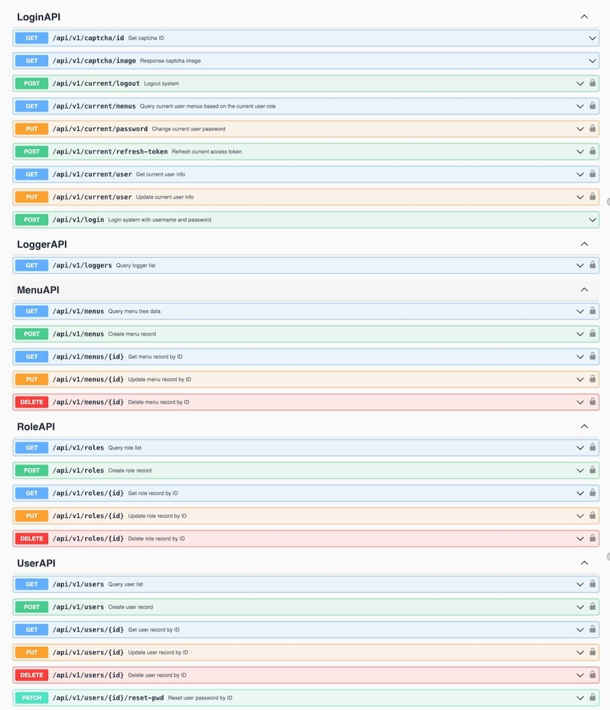

# [Gin](https://github.com/gin-gonic/gin)-Admin

> A lightweight, flexible, elegant and full-featured RBAC scaffolding based on GIN + GORM 2.0 + Casbin 2.0 + Wire DI.

English | [中文](README_CN.md)

[](https://github.com/LyricTian/gin-admin/blob/main/LICENSE)
[](https://golang.org/)
[](https://goreportcard.com/report/github.com/LyricTian/gin-admin)
[](https://github.com/LyricTian/gin-admin/releases)
[](https://github.com/LyricTian/gin-admin/releases)
[](https://godoc.org/github.com/LyricTian/gin-admin)

## Features

- :scroll: Follow the `RESTful API` design specification & interface-based programming specification
- :house: More concise project structure, modular design, improve code readability and maintainability
- :toolbox: Based on the `GIN` framework, it provides rich middleware support (JWTAuth, CORS, RequestLogger, RequestRateLimiter, TraceID, Casbin, Recover, GZIP, StaticWebsite)
- :closed_lock_with_key: RBAC access control model based on `Casbin`
- :card_file_box: Database access layer based on `GORM 2.0`
- :electric_plug: Dependency injection based on `WIRE` -- the role of dependency injection itself is to solve the cumbersome initialization process of hierarchical dependencies between modules
- :zap: Log output based on `Zap & Context`, and unified output of key fields such as TraceID/UserID through combination with Context (also supports log hooks written to `GORM`)
- :key: User authentication based on `JWT`
- :microscope: Automatically generate `Swagger` documentation based on `Swaggo` - [Preview](http://101.42.232.163:8040/swagger/index.html)
- :test_tube: Implement API unit testing based on `testify`
- :100: Stateless service, horizontally scalable, improves service availability - dynamic permission management of Casbin is implemented through scheduled tasks and Redis
- :hammer: Complete efficiency tools, can develop complete code modules through configuration - [gin-admin-cli](https://github.com/gin-admin/gin-admin-cli)



## Frontend

- [Frontend project based on Ant Design React](https://github.com/gin-admin/gin-admin-frontend) - [Preview](http://101.42.232.163:8040/): admin/abc-123
- [Frontend project based on Vue.js](https://github.com/gin-admin/gin-admin-vue) - [Preview](http://101.42.232.163:8080/): admin/abc-123

## Dependencies

- [Go](https://golang.org/) 1.19+
- [Wire](github.com/google/wire) `go install github.com/google/wire/cmd/wire@latest`
- [Swag](github.com/swaggo/swag) `go install github.com/swaggo/swag/cmd/swag@latest`
- [GIN-ADMIN-CLI](https://github.com/gin-admin/gin-admin-cli) `go install github.com/gin-admin/gin-admin-cli/v10@latest`

## Quick Start

### Create a new project

```bash
gin-admin-cli new -d ~/go/src --name testapp --desc 'A test API service based on golang.' --pkg 'github.com/xxx/testapp'
```

### Start the service

```bash
cd ~/go/src/testapp
make start
# or
go run main.go start
```

### Generate a new module

> For more detailed usage instructions, please refer to [gin-admin-cli](https://github.com/gin-admin/gin-admin-cli)

```bash
gin-admin-cli gen -d . -m CMS --structs Article --structs-comment 'Article management'
```

### Remove a module

```bash
gin-admin-cli rm -d . -m CMS -s Article
```

### Build the service

```bash
make build
# or
go build -ldflags "-w -s -X main.VERSION=v1.0.0" -o ginadmin
```

### Generate swagger docs

```bash
make swagger
# or
swag init --parseDependency --generalInfo ./main.go --output ./internal/swagger
```

### Generate wire inject

```bash
make wire
# or
wire gen ./internal/wirex
```

## Project Layout

```text
├── cmd
│   ├── start.go
│   ├── stop.go
│   └── version.go
├── configs
│   ├── dev
│   │   ├── logging.toml           (Log configuration file)
│   │   ├── middleware.toml        (Middleware configuration file)
│   │   └── server.toml            (Service configuration file)
│   ├── menu.json                  (Initialize menu file)
│   └── rbac_model.conf            (Casbin RBAC model configuration file)
├── internal
│   ├── bootstrap
│   │   ├── bootstrap.go          (Initialization)
│   │   ├── http.go               (HTTP service)
│   │   └── logger.go             (Log service)
│   ├── config                    (Configuration file)
│   │   ├── config.go
│   │   ├── consts.go
│   │   ├── middleware.go
│   │   └── parse.go
│   ├── mods
│   │   ├── rbac                  (RBAC module)
│   │   │   ├── api               (API layer)
│   │   │   ├── biz               (Business logic layer)
│   │   │   ├── dal               (Data access layer)
│   │   │   ├── schema            (Data model layer)
│   │   │   ├── casbin.go         (Casbin initialization)
│   │   │   ├── main.go           (Module initialization)
│   │   │   └── wire.go           (Dependency injection)
│   │   ├── sys
│   │   │   ├── api
│   │   │   ├── biz
│   │   │   ├── dal
│   │   │   ├── schema
│   │   │   ├── main.go
│   │   │   └── wire.go
│   │   └── mods.go
│   ├── utility
│   │   └── prom
│   │       └── prom.go           (Prometheus)
│   └── wirex                     (Dependency injection)
│       ├── injector.go
│       ├── wire.go
│       └── wire_gen.go
├── test                          (Unit test)
│   ├── menu_test.go
│   ├── role_test.go
│   ├── test.go
│   └── user_test.go
├── Dockerfile
├── Makefile
├── README.md
├── go.mod
├── go.sum
└── main.go                       (Entry)
```

## Community

- [Discord](https://discord.gg/UCnpActY)
