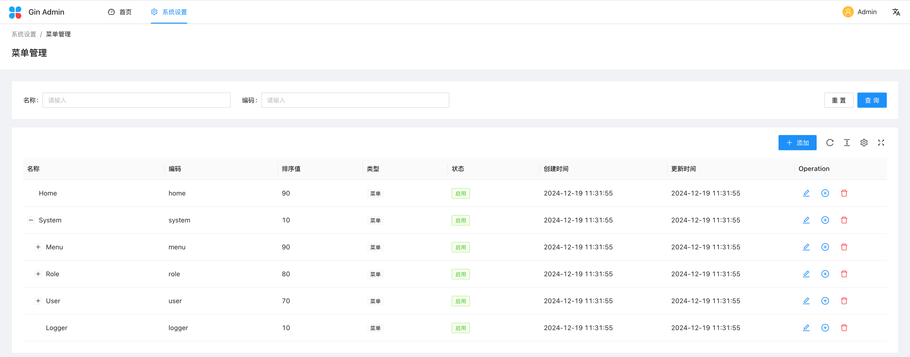
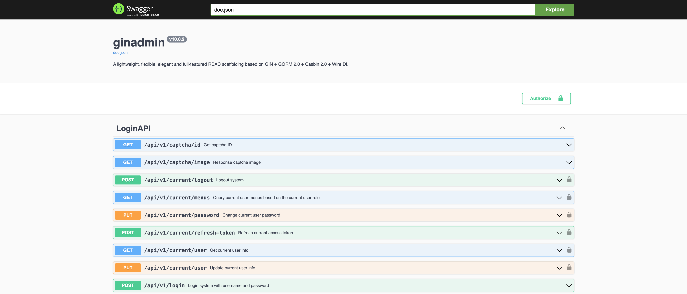

# [Gin](https://github.com/gin-gonic/gin)-Admin

> A lightweight, flexible, elegant and full-featured RBAC scaffolding based on Golang + Gin + GORM 2.0 + Casbin 2.0 + Wire DI.

English | [中文](README.md)

[](https://github.com/LyricTian/gin-admin/blob/main/LICENSE)
[](https://golang.org/)
[](https://goreportcard.com/report/github.com/LyricTian/gin-admin)
[](https://github.com/LyricTian/gin-admin/releases)
[](https://github.com/LyricTian/gin-admin/releases)
[](https://godoc.org/github.com/LyricTian/gin-admin)

## Features

- :scroll: Elegant implementation of `RESTful API`, using interface-based programming paradigm to make your API design more professional and standardized
- :house: Adopts clear and concise modular architecture, making code structure clear at a glance, maintenance and upgrades more effortless
- :rocket: Based on high-performance `GIN` framework, integrating rich and practical middleware (authentication, CORS, logging, rate limiting, tracing, permission control, fault tolerance, compression, etc.), helping you quickly build enterprise-level applications
- :closed_lock_with_key: Integrates industry-leading `Casbin` permission framework, flexible and precise RBAC permission control makes security protection rock solid
- :page_facing_up: Based on powerful `GORM 2.0` ORM framework, elegantly handles database operations, greatly improving development efficiency
- :electric_plug: Innovatively adopts `WIRE` dependency injection, revolutionarily simplifies module dependency relationships, making code more elegant and decoupled
- :memo: Based on high-performance `Zap` logging framework, coupled with Context tracing, making system running status clear and transparent, problem troubleshooting nowhere to hide
- :key: Integrates time-tested `JWT` authentication mechanism, making user identity verification more secure and reliable
- :microscope: Automatically integrates `Swagger` API documentation, real-time API documentation updates, making development and debugging easier - [Online Demo](https://demo.ginadmin.top/swagger/index.html)
- :wrench: Complete unit testing system, based on `testify` framework to ensure system quality, leaving no place for bugs to hide
- :100: Adopts stateless design, supports horizontal scaling, paired with Redis to implement dynamic permission management, letting your system easily handle high concurrency
- :hammer: Developer's blessing! Powerful scaffolding tool [gin-admin-cli](https://github.com/gin-admin/gin-admin-cli), making your development work twice as efficient




## Frontend Projects

- [Frontend project based on Ant Design React](https://github.com/gin-admin/gin-admin-frontend)
- [Frontend project based on Vue.js](https://github.com/gin-admin/gin-admin-vue)

## Install Dependencies

- [Go](https://golang.org/) 1.19+
- [Wire](github.com/google/wire) `go install github.com/google/wire/cmd/wire@latest`
- [Swag](github.com/swaggo/swag) `go install github.com/swaggo/swag/cmd/swag@latest`
- [GIN-ADMIN-CLI](https://github.com/gin-admin/gin-admin-cli) `go install github.com/gin-admin/gin-admin-cli/v10@latest`

## Quick Start

### Create a New Project

> You can view detailed command instructions via `gin-admin-cli help new`

```bash
gin-admin-cli new -d ~/go/src --name testapp --desc 'A test API service based on golang.' --pkg 'github.com/xxx/testapp' --git-url https://gitee.com/lyric/gin-admin.git
```

### Start the Service

> You can switch to Chinese menu by changing `MenuFile = "menu_cn.json"` in the `configs/dev/server.toml` configuration file

```bash
cd ~/go/src/testapp

make start
# or
go run main.go start
```

### Compile the Service

```bash
make build
# or
go build -ldflags "-w -s -X main.VERSION=v1.0.0" -o testapp
```

### Generate Docker Image

```bash
docker build -f ./Dockerfile -t testapp:v1.0.0 .
```

### Generate Codes

> You can view detailed command instructions via `gin-admin-cli help gen`

#### Prepare Configuration File `dictionary.yaml`

```yaml
- name: Dictionary
  comment: Dictionary management
  disable_pagination: true
  fill_gorm_commit: true
  fill_router_prefix: true
  tpl_type: "tree"
  fields:
    - name: Code
      type: string
      comment: Code of dictionary (unique for same parent)
      gorm_tag: "size:32;"
      form:
        binding_tag: "required,max=32"
    - name: Name
      type: string
      comment: Display name of dictionary
      gorm_tag: "size:128;index"
      query:
        name: LikeName
        in_query: true
        form_tag: name
        op: LIKE
      form:
        binding_tag: "required,max=128"
    - name: Description
      type: string
      comment: Details about dictionary
      gorm_tag: "size:1024"
      form: {}
    - name: Sequence
      type: int
      comment: Sequence for sorting
      gorm_tag: "index;"
      order: DESC
      form: {}
    - name: Status
      type: string
      comment: Status of dictionary (disabled, enabled)
      gorm_tag: "size:20;index"
      query: {}
      form:
        binding_tag: "required,oneof=disabled enabled"
```

```bash
gin-admin-cli gen -d . -m SYS -c dictionary.yaml
```

### Delete Function Module

> You can view detailed command instructions via `gin-admin-cli help remove`

```bash
gin-admin-cli rm -d . -m CMS --structs Article
```

### Generate Swagger Documentation

> You can generate Swagger documentation automatically via [Swag](github.com/swaggo/swag)

```bash
make swagger
# or
swag init --parseDependency --generalInfo ./main.go --output ./internal/swagger
```

### Generate Dependency Injection Code

> Dependency injection itself is used to solve the initial process of layer dependency among various modules, and you can generate dependency injection code automatically via [Wire](github.com/google/wire) to simplify the dependency injection process.

```bash
make wire
# or
wire gen ./internal/wirex
```

## Project Structure Overview

```text
├── cmd                             (Command line definition directory)
│   ├── start.go                    (Start command)
│   ├── stop.go                     (Stop command)
│   └── version.go                  (Version command)
├── configs
│   ├── dev
│   │   ├── logging.toml            (Logging configuration file)
│   │   ├── middleware.toml         (Middleware configuration file)
│   │   └── server.toml             (Service configuration file)
│   ├── menu.json                   (Initialization menu file)
│   └── rbac_model.conf             (Casbin RBAC model configuration file)
├── internal
│   ├── bootstrap                   (Initialization directory)
│   │   ├── bootstrap.go            (Initialization)
│   │   ├── http.go                 (HTTP service)
│   │   └── logger.go               (Logging service)
│   ├── config                      (Configuration file directory)
│   │   ├── config.go               (Configuration file initialization)
│   │   ├── consts.go               (Constant definition)
│   │   ├── middleware.go           (Middleware configuration)
│   │   └── parse.go                (Configuration file parsing)
│   ├── mods
│   │   ├── rbac                    (RBAC module)
│   │   │   ├── api                 (API layer)
│   │   │   ├── biz                 (Business logic layer)
│   │   │   ├── dal                 (Data access layer)
│   │   │   ├── schema              (Data model layer)
│   │   │   ├── casbin.go           (Casbin initialization)
│   │   │   ├── main.go             (RBAC module entry)
│   │   │   └── wire.go             (RBAC dependency injection initialization)
│   │   └── mods.go
│   ├── utility
│   │   └── prom
│   │       └── prom.go             (Prometheus monitoring, used for integration with prometheus)
│   └── wirex                       (Dependency injection directory, contains the definition and initialization of dependency groups)
│       ├── injector.go
│       ├── wire.go
│       └── wire_gen.go
├── pkg                             (Public package directory)
│   ├── cachex                      (Cache package)
│   ├── crypto                      (Encryption package)
│   │   ├── aes                     (AES encryption)
│   │   ├── hash                    (Hash encryption)
│   │   └── rand                    (Random number)
│   ├── encoding                    (Encoding package)
│   │   ├── json                    (JSON encoding)
│   │   ├── toml                    (TOML encoding)
│   │   └── yaml                    (YAML encoding)
│   ├── errors                      (Error handling package)
│   ├── gormx                       (Gorm extension package)
│   ├── jwtx                        (JWT package)
│   ├── logging                     (Logging package)
│   ├── mail                        (Mail package)
│   ├── middleware                  (Middleware package)
│   ├── oss                         (Object storage package)
│   ├── promx                       (Prometheus package)
│   └── util                        (Utility package)
├── test                            (Unit test directory)
│   ├── menu_test.go
│   ├── role_test.go
│   ├── test.go
│   └── user_test.go
├── Dockerfile
├── Makefile
├── README.md
├── go.mod
├── go.sum
└── main.go                         (Entry file)
```

## License

Copyright (c) 2023 Lyric

Licensed under the Apache License, Version 2.0 (the "License");
you may not use this file except in compliance with the License.
You may obtain a copy of the License at

    http://www.apache.org/licenses/LICENSE-2.0

Unless required by applicable law or agreed to in writing, software
distributed under the License is distributed on an "AS IS" BASIS,
WITHOUT WARRANTIES OR CONDITIONS OF ANY KIND, either express or implied.
See the License for the specific language governing permissions and
limitations under the License.
